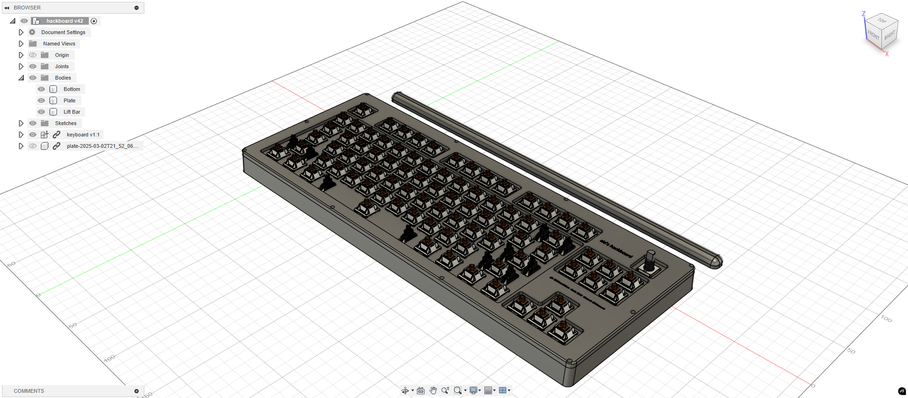
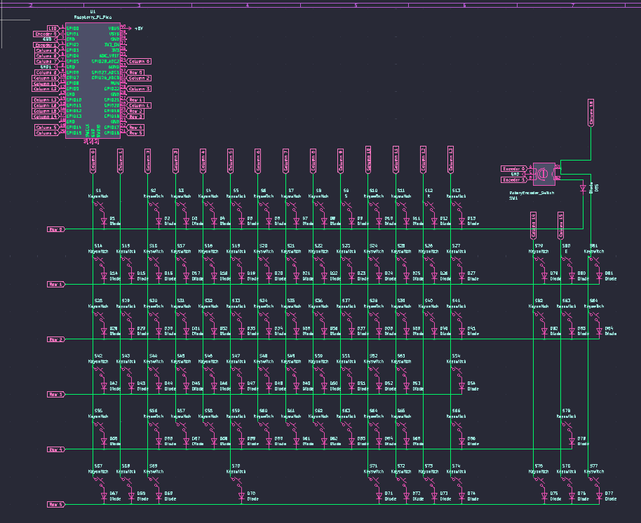
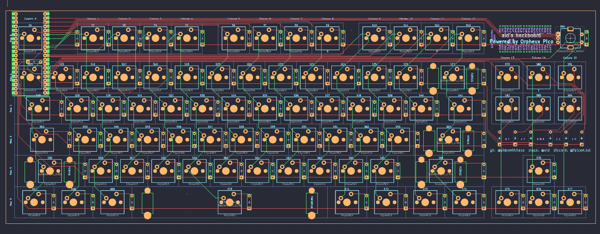
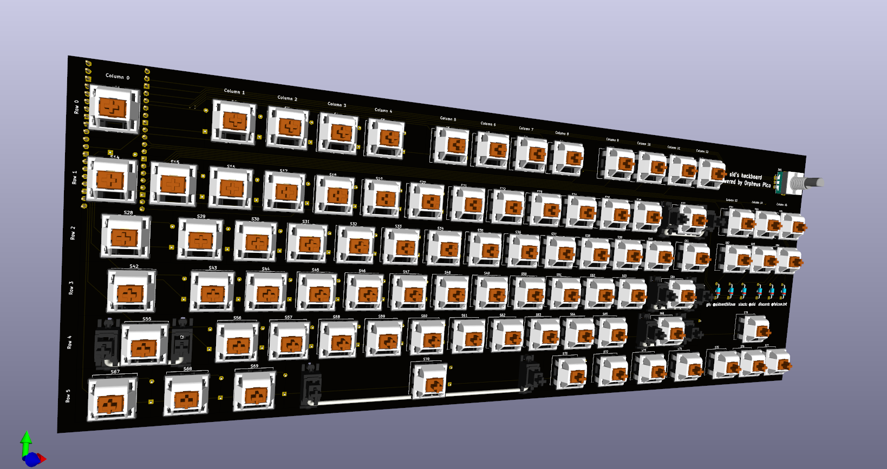
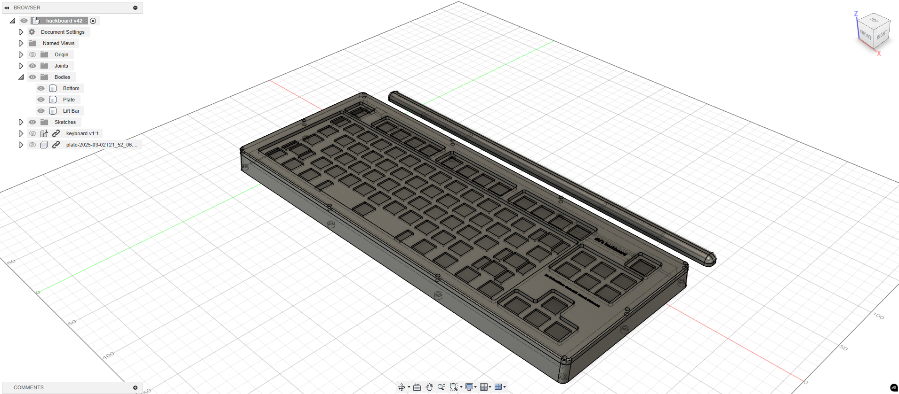

# Sid's Hackboard
My hackboard is pretty closely based on my current keyboard (Steelseries Apex 3 TKL) because it fits very well for what I need it to do. Probably could have optimized it more but ran out of time.
I'll probably make some keys macros especially the cluster around Delete.
This was actually way easier than hackpad because I now use KiCad and Fusion a lot more (even for other projects), but figuring out how to do the integrated plate was a bit annoying, and drafting the edges also took some figuring out.
Anyway I made a (hopefully) functional keyboard.

# Key Features:
* Standard TKL layout
* Plate with integrated case
* Magnetic lift bar
* Volume knob

# CAD/case:
M3 bolts and heatset inserts are used to hold the 2 pieces together, and an integrated plate is used to hold the pcb.

# PCB:
A matrix is wired to prevent ghosting - the wiring took way too long.

# Firmware:
KMK was used for the firmware, I still need to figure out how to implement the volume controls though.

# BOM:

|ITEM|QTY|
|----|---|
|Orpheus Pico|1|
|switches|qty|
|stabs|qty|
|encoder|qty|
|magnets|qty|
|1N4148 diodes|qty|
|keycaps|qty|
|bolts|qty|
|heatset inserts|qty|

# Images:
Fully assembled:          
               
Schematic:          
                           
PCB:            
                                                    
Case:                                                     
          